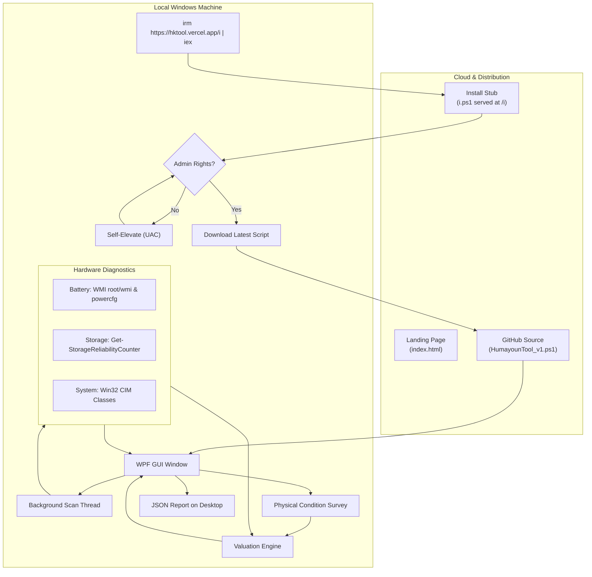

# Humayoun Kobir Tool (HK-Tool)

<div align="center">


### বিক্রির আগে, সত্যিটা জানুন — Know the truth, before you sell.

A lightweight hardware diagnostic tool and resale valuation utility for Windows laptops and desktops. Runs directly in PowerShell with zero installation.

[Website](https://hktool.vercel.app) • [GitHub Repository](https://github.com/humayunk45423/HK-Tool) • [Installer Endpoint](https://hktool.vercel.app/i)

---

</div>

## Table of Contents

- [The Core Idea](#the-core-idea)
- [Why This Tool Exists](#why-this-tool-exists)
- [How to Run It](#how-to-run-it)
- [How the Whole Technology Works](#how-the-whole-technology-works)
  - [1. Distribution Model (Zero-Install Execution)](#1-distribution-model-zero-install-execution)
  - [2. The User Interface (PowerShell + WPF)](#2-the-user-interface-powershell--wpf)
  - [3. Hardware Inspection (How Telemetry is Gathered)](#3-hardware-inspection-how-telemetry-is-gathered)
  - [4. The Pricing and Valuation Math](#4-the-pricing-and-valuation-math)
  - [5. The Web Landing Page](#5-the-web-landing-page)
- [Architecture Diagram](#architecture-diagram)
- [The Pricing Formula](#the-pricing-formula)
- [Data Privacy and Local Execution](#data-privacy-and-local-execution)
- [Repository Structure](#repository-structure)
- [Current Limitations & What's Next](#current-limitations--whats-next)
- [License](#license)

---

## The Core Idea

When someone sells a second-hand laptop or desktop in Bangladesh (or anywhere else), buyers usually get vague assurances: *"Battery backup is great,"* *"Condition is fresh,"* or *"SSD is super fast."*

In reality:
- Batteries degrade quietly. Cycle counts and design capacity wear are hidden unless you know how to run specific CLI commands.
- Solid-state drives wear out silently. A drive might be running at high temperatures or close to failure without the operating system showing an obvious warning.
- Sellers often misremember or exaggerate exact hardware generations (e.g. confusing an older dual-core i7 with a modern multi-core i5).
- Setting a fair price is usually an argument of pure guesswork.

**HK-Tool** fixes this by reading the actual hardware chips inside the machine, running a quick physical checklist with the user, and calculating a transparent, realistic price range.

---

## Why This Tool Exists

Most benchmark and diagnostic tools have one of three problems:
1. They require downloading a 100MB+ setup file with installers, bundled software, or account signups.
2. They dump raw technical numbers that average people cannot interpret.
3. They give no context on what the computer is actually worth in the local market.

HK-Tool was built to follow the model popularized by utilities like Chris Titus Tech's WinUtil:
- Run one line in PowerShell.
- Inspect the live hardware immediately.
- Get a clear verdict and price breakdown on screen.
- Close the window when done, leaving nothing installed.

---

## How to Run It

You do not need to download an installer or set up any dependencies.

1. Open PowerShell as Administrator (press `Win + X` and select **Terminal (Admin)** or **Windows PowerShell (Admin)**).
2. Paste this command and hit Enter:

```powershell
irm https://hktool.vercel.app/i | iex
```

### What that command actually does:
- `irm` (`Invoke-RestMethod`): Downloads the short bootstrap launcher script from `https://hktool.vercel.app/i`.
- `| iex` (`Invoke-Expression`): Executes that launcher in memory. The launcher confirms administrator permissions, grabs the latest release from GitHub, and launches the diagnostic interface.

---

## How the Whole Technology Works

### 1. Distribution Model (Zero-Install Execution)

The distribution workflow has three components working together:

1. **Vercel Edge Router (`vercel.json`)**:
   The landing site is hosted on Vercel. When a request hits `/i`, Vercel silently rewrites and serves the raw script file `i.ps1`.
2. **Bootstrap Loader (`i.ps1`)**:
   When the user runs `irm https://hktool.vercel.app/i | iex`, this tiny 20-line script runs first.
   - It checks if the current PowerShell session has Administrator rights.
   - If not, it self-elevates by triggering a Windows UAC prompt.
   - Once elevated, it pulls the full tool script (`HumayounTool_v1.ps1`) directly from GitHub using a dynamic timestamp query to bypass any CDN caching.
3. **In-Memory Launch**:
   The full tool runs directly on the local machine without adding entries to Windows Add/Remove Programs or cluttering system folders.

---

### 2. The User Interface (PowerShell + WPF)

PowerShell scripts are usually just text consoles. HK-Tool uses **Windows Presentation Foundation (WPF)** to render a dark-mode graphical desktop application.

Here is how that works without compiling an executable:
- The UI layout is defined inside the script using standard XML/XAML markup.
- PowerShell dynamically loads the .NET presentation assemblies (`PresentationFramework`, `PresentationCore`, `WindowsBase`).
- `[System.Windows.Markup.XamlReader]::Load()` parses the XAML string into live UI controls.
- **Asynchronous Hardware Scanning**: Querying hardware registers can take 1–3 seconds. To keep the UI fluid and responsive without freezing the window, the scan runs in a background PowerShell runspace (`[System.Management.Automation.PowerShell]::Create()`). A UI `DispatcherTimer` periodically checks for completion while animating status text.

---

### 3. Hardware Inspection (How Telemetry is Gathered)

The tool interrogates internal Windows interfaces to get unfiltered hardware data:

#### Battery Telemetry
- **Primary Method**: Queries the ACPI driver through WMI (`root\wmi` namespace) using classes `BatteryStaticData`, `BatteryFullChargedCapacity`, and `BatteryCycleCount`. This directly provides the original factory design capacity (mWh), the current maximum full charge capacity (mWh), and the physical cycle count.
- **Fallback Method**: If an OEM laptop driver restricts WMI access, the script generates a temporary Windows battery report via `powercfg /batteryreport` and uses regular expressions to extract design capacity and charge cycles.
- **Health Calculation**:
  $$\text{Battery Health } \% = \left(\frac{\text{Full Charge Capacity}}{\text{Design Capacity}}\right) \times 100$$

#### Storage Health (SSDs & Hard Drives)
- Uses storage management cmdlets `Get-PhysicalDisk` and `Get-StorageReliabilityCounter`.
- Pulls media type (NVMe SSD, SATA SSD, HDD), drive temperature in Celsius, operational SMART health status, and wear level percentage.

#### System, CPU, GPU, and RAM
- Uses CIM (Common Information Model) queries:
  - `Win32_Processor`: Exact model name, clock speed, core and thread counts.
  - `Win32_VideoController`: Integrated and dedicated graphics cards.
  - `Win32_PhysicalMemory`: Installed memory modules, speeds, and total capacity.
  - `Win32_OperatingSystem`: Windows edition, exact build number, and uptime.
  - `Win32_BIOS`: BIOS release date (used as a reliable proxy for the system's manufacturing timeline).
  - `Win32_BaseBoard`: Motherboard manufacturer and model.

---

### 4. The Pricing and Valuation Math

HK-Tool does not pull arbitrary random numbers. It calculates price in three logical steps:

#### Step A: Base Hardware Valuation ($V_{\text{base}}$)
The tool evaluates what the bare hardware specifications are worth assuming normal used condition:
- Baseline starting value: ৳5,000.
- Processor tier baseline:
  - Intel Core i3 / Ryzen 3: +৳3,000 to ৳4,000
  - Intel Core i5 / Ryzen 5: +৳6,000 to ৳7,000
  - Intel Core i7 / Ryzen 7: +৳10,000 to ৳12,000
  - Intel Core i9 / Ryzen 9: +৳16,000 to ৳18,000
  - Apple Silicon (M1 / M2 / M3): +৳35,000 to ৳70,000
- Generation adjustment: Adds value per generation for modern architectures.
- Memory: Adds ৳400 per GB above 4GB.
- Storage: ৳12 per GB with specific bonuses for SSD (+৳1,500) and NVMe (+৳2,500).
- Dedicated GPU: Evaluates discrete graphics tiers from older GTX cards up to modern RTX 30/40 series cards (+৳8,000 to ৳60,000).

#### Step B: Diagnostic and Physical Condition Score
- **Diagnostic Score**: Average of battery health percentage and storage reliability score.
- **Condition Score**: Calculated from the user's answers on the survey tab (Screen, Body, Keyboard, Ports, Camera, Speakers).
- **Overall Score**: Weighted 50% on hardware diagnostics and 50% on physical condition.

#### Step C: Realistic Price Range
Rather than giving a single rigid price, the tool produces a realistic negotiation range:
- Minimum fair price: $V_{\text{base}} \times \text{OverallScore} \times 0.85$
- Maximum fair price: $V_{\text{base}} \times \text{OverallScore} \times 1.05$

---

### 5. The Web Landing Page

The website (`index.html`) is built cleanly in standard HTML, CSS, and vanilla JavaScript without heavy frameworks or build chains:
- **Bilingual Interface (Bangla & English)**: Every text node contains both `data-en` and `data-bn` attributes. A lightweight client script toggles the language instantly and translates Western numerals (0-9) to Bengali digits (০-৯).
- **Live SVG Scorecard**: The hero section renders an interactive SVG radial gauge that mirrors what the desktop tool produces.
- **Hosted on Vercel**: Delivers low latency worldwide and serves both the landing page and the PowerShell bootstrapper.

---

## Architecture Diagram



---

## The Pricing Formula

For those who want to see the exact arithmetic used in code:

```
DiagnosticScore = (BatteryHealthPct + StorageScore) / 2

OverallScore    = ((DiagnosticScore * 0.5) + (ConditionScore * 0.5)) / 100

PriceMin        = RoundToNearest100(BaseHardwareValue * OverallScore * 0.85)

PriceMax        = RoundToNearest100(BaseHardwareValue * OverallScore * 1.05)
```

---

## Data Privacy and Local Execution

- **Zero Data Collection**: The tool does not send hardware serial numbers, MAC addresses, IP addresses, or diagnostic logs to any remote server or analytics endpoint.
- **Local JSON Export**: When you click "Export JSON Report", the file is saved strictly to your local Windows Desktop (`HKT_Report_YYYYMMDD_HHMMSS.json`).
- **Completely Inspectable**: Because the tool is an uncompiled PowerShell script, anyone can open `HumayounTool_v1.ps1` in a text editor to verify every command before running it.

---

## Repository Structure

```
HK-Tool/
├── index.html                           # Landing page (Bilingual: English & Bangla)
├── i.ps1                                # Bootstrap installer stub (served at /i)
├── HumayounTool_v1.ps1                  # Main desktop GUI and diagnostic script
├── vercel.json                          # Edge routing configuration for Vercel
├── logo.png                             # Application logo
├── HUMAYOUN_TOOL_SESSION_CONTEXT_1.md   # Project context and architectural notes
└── README.md                            # Documentation
```

---

## Current Limitations & What's Next

- **Windows Only**: Current diagnostics rely heavily on Windows WMI, CIM, and ACPI APIs. Support for macOS and Linux is an area for future exploration.
- **Non-English Windows Locale Edge Cases**: Battery report regex fallback is tested primarily on English Windows installs; native WMI queries are used first to minimize locale dependency.
- **Future Pricing Engine**: Transitioning the base pricing model from hardcoded heuristics to a connected API with real-time scraped marketplace listings.

---

## License

This project is open source under the MIT License. Feel free to use, modify, and distribute it.
